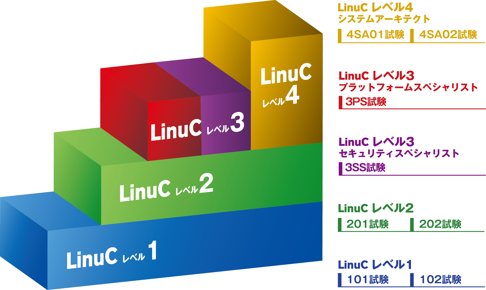

# まえがき {.unlisted .unnumbered}
このたび、特定非営利活動法人エルピーアイジャパンは、Linux技術者教育に利用していただくことを目的とした教材「Linuxネットワーク標準教科書」（以下、本教科書）を開発し、インターネット上にて公開し、提供することとなりました。

本教科書は、多くの教育機関からLinuxを「基礎」から学習するための教材や学習環境の整備に対するご要望があり、開発したものです。

公開にあたっては、本教科書に添付されたライセンス（クリエイティブ・コモンズ・ライセンス）の下に公開されています。

本教科書は、最新の技術動向に対応するため、随時アップデートを行っていきます。

本教科書の最新情報は以下のWebページをご参照ください。

```
https://linuc.org/textbooks/network/
```

## 本教科書の目的 {.unlisted .unnumbered}
本教科書の目的は、「Linuxサーバー構築標準教科書」をはじめとした「標準教科書シリーズ」で解説しきれなかったネットワークの知識を、実習を通しながら学習することにあります。

実際にLinuxを操作して、ネットワークの仕組みを理解することができます。

## 全体の流れ {.unlisted .unnumbered}
本教科書では、以下の通りに実習を進めます。

### 1章 ネットワーク学習環境の構築 {.unlisted .unnumbered}
実習環境の構築と、VirtualBoxのネットワークについて解説します。また、パケットキャプチャを行うためにWiresharkをインストールします。

### 2章 IPアドレス {.unlisted .unnumbered}
インターネットの通信の基盤であるIPの仕組みと、IPアドレスについて解説します。

### 3章 TCP/UDP/ICMP {.unlisted .unnumbered}
IP通信の上で使用される、TCPやUDP、ICMPについて解説します。

### 4章 パケットフィルタリング {.unlisted .unnumbered}
IPアドレスやポート番号などを元にパケット通信の許可や拒否を行うパケットフィルタリングについて解説します。

### 5章 ルーティングとIPマスカレード {.unlisted .unnumbered}
インターネットの基本的な通信の仕組みであるネットワーク間を接続する仕組みであるルーティングについて解説します。また、Linuxカーネルのアドレス変換の仕組みであるIPマスカレードについて解説します。

### 6章 ネットワークインターフェースの管理 {.unlisted .unnumbered}
ネットワークの通信を担うハードウェアであるネットワークインターフェースについて解説します。複数のネットワークインターフェースを束ねて冗長化する方法も解説します。

### 7章 Ubuntuのネットワーク管理 {.unlisted .unnumbered}
Ubuntuのネットワーク管理に使われるツール(netplan・ufw)について解説します。

## 執筆者・制作者紹介 {.unlisted .unnumbered}
本教科書は、オープンなプロジェクト形式で開発を行っています。企画段階から意見交換を行い、事前の技術的な調査、執筆、レビューなどをプロジェクトのメンバーで分担して行っています。

### 宮原 徹（1~6章 執筆担当） {.unlisted .unnumbered}
本教科書は、Linux/オープンソースソフトウェアをこれから勉強する皆さんと、熱心に指導に当たられている先生方の一助になればと思い、作成いたしました。「標準教科書」シリーズ 3部作の改訂を完了させましたが、ネットワークの解説をかなり省略してしまったので、別途補完する形で本教科書を企画、執筆しました。

Linuxはネットワークに接続することでその真価を発揮するので、ネットワークについてもしっかりと理解する一助になれば幸いです。

### 鯨井 貴博（7章 執筆担当） {.unlisted .unnumbered}
「Linuxサーバー構築標準教科書 Ubuntu版」に引き続き、Ubuntuのネットワーク管理について執筆しました。
読者の方が様々なLinuxディストリビューションを使いこなせる技術者となるために役立てれば、幸いです。

### バージョン4の開発にご協力をいただいた方々（50音順） {.unlisted .unnumbered}
- 秋庭 雅明（データプロセス株式会社）
- 河原木 忠司
- 鯨井 貴博（株式会社ゼウス・エンタープライズ）
- 中 翔（士業AI／FDE Consulting）
- 西 侑一郎（株式会社アーベルソフト）
- 樋口 侑磨（大学生）
- 福永 昭臣（株式会社ボールド）

## 著作権 {.unlisted .unnumbered}
本教科書の著作権は特定非営利活動法人エルピーアイジャパンに帰属します。

Copyright©️ LPI-Japan. All Rights Reserved.

## 使用に関する権利 {.unlisted .unnumbered}
本教科書は、クリエイティブ・コモンズ・ライセンスの「表示 - 非営利 - 改変禁止 4.0 国際 (CC BY-NC-ND 4.0) 」によってライセンスされています。

{width=200px}


### 表示 {.unlisted .unnumbered}
本教科書は、特定非営利活動法人エルピーアイジャパンに著作権が帰属するものであることを表示してください。

### 非営利 {.unlisted .unnumbered}
本教科書は、非営利目的で教材として自由に利用することができます。

商業上の利得や金銭的報酬を主な目的とした営利目的での利用は、特定非営利活動法人エルピーアイジャパンによる許諾が必要です。ただし、本教科書を利用した教育において、本教科書自体の対価を請求しない場合は、営利目的の教育であっても基本的に使用できます。
その場合も含め、LPI-Japan 事務局までお気軽にお問い合わせください。

＊営利目的の利用とは以下のとおり規定しております。
営利企業または非営利団体において、商業上の利得や金銭的報酬を目的に本教科書の印刷実費以上の対価を受講生に請求して本教科書の複製を用いた研修や講義を行うこと。

### 改変禁止 {.unlisted .unnumbered}
本教科書は、改変せず使用してください。本教科書に対する改変は、特定非営利活動法人エルピーアイジャパンまたは特定非営利活動法人エルピーアイジャパンが認める団体により行われています。

## フィードバック {.unlisted .unnumbered}
フィードバックは誰でも参加できる Slack で受け付けていますので、積極的にご参加ください。Slack参加の詳細は以下の本教科書のWebページを参照してください。

```
https://linuc.org/textbooks/network/
```

{width=25%}

## 本教科書の使用に関するお問合せ先 {.unlisted .unnumbered}
特定非営利活動法人エルピーアイジャパン（LPI-Japan）事務局

```
お問い合わせ：https://lpij.tayori.com/f/textbookinfo/
```

{width=25%}

\pagebreak
## Linux技術者認定「LinuC（リナック）」のご紹介 {.unlisted .unnumbered}
Linux技術者認定「LinuC（リナック）」とは、クラウド／DX時代のITエンジニアに求められるシステム構築から運用管理に必要なスキルを証明できる技術者認定です。アーキテクチャ設計からシステム構築、運用管理までの技術領域を広くカバーしており、４つのレベルの認定取得を通じて一歩ずつ確実に求められるスキルを習得し、それを証明することができます。

LinuCの出題範囲策定や試験開発は、実際に現場で活躍しているハイレベルなITエンジニアが参加するコミュニティによって行われています。そのため、グローバルで業界標準として利用されている技術領域をカバーし、システム開発や運用管理の現場で本当に必要とされる知識や実践的なスキルを問う内容になっています。その結果として従来型のLinux領域にとどまった技術認定とは異なり、国内・海外を問わず活躍を目指すITエンジニアにとっても十分役立つ技術者認定となりました。

{width=50%}

### LinuCレベル１ {.unlisted .unnumbered}
コンピュータシステムを理解し、仮想環境を含むLinuxシステムの基本操作とシステム管理が行える即戦力エンジニアの証明（ITSSレベル1）

### LinuCレベル２ {.unlisted .unnumbered}
仮想環境を含むLinuxのシステム設計・ネットワーク構築において、アーキテクチャに基づいた設計・導入・保守・問題解決ができるエンジニアの証明（ITSSレベル2）

### LinuCレベル３ プラットフォームスペシャリスト・セキュリティスペシャリスト {.unlisted .unnumbered}
仮想化・自動化などにより柔軟性と可用性を備えたLinuxプラットフォームの構築運用や、セキュアLinuxシステムのためのOSからミドルウェアまでの各層堅牢化や認証認可基盤の構築および攻撃対策を実現できるスペシャリストの証明（ITSSレベル3）

### LinuCレベル４ システムアーキテクト {.unlisted .unnumbered}
オンプレ／クラウド、物理／仮想化を含むシステムのライフサイクル全体を俯瞰して最適なアーキテクチャを設計・構築ができる上級エンジニアの証明（ITSSレベル4）

\pagebreak
LinuCの詳細については、以下のWebサイトを参照してください。

```
https://linuc.org/about/01.html
```

{width=25%}

\pagebreak

