# IPアドレス
IPアドレスは、インターネットの通信の基盤であるIP（Internet Protocol）において、通信を行う各端末（ノード）に割り当てられるアドレスです。適切なIPアドレスが割り当てられることで、ネットワークを経由してお互いに通信が行えます。

IPアドレスには様々な要素が関係してくるので、それらについて解説していきます。

## 用語について
ネットワークの解説では、ほぼ同様のものが文脈や役割によって呼び方が異なる場合があります。

たとえば、以下の言葉はすべて概ね同じく1台のコンピューターのことを指しています。

- ホスト
- マシン
- 端末
- ノード
- サーバー
- クライアント

## IPv4とIPv6
本教科書においては、IPといった場合にはIPv4を指します。

IPv4のIPアドレスは32ビットで表されます。32ビットで表せるIPアドレスの個数は約43億個となるので、世界中に張り巡らされたインターネット上で割り当てるのには数が不足しています。

そこで作られたのがIPv6です。IPv6はIPアドレスを128ビットで表すため、IPアドレスは約340澗（かん）個（43億の4乗）と事実上無制限の個数となります。

本教科書ではIPv6については解説しません。IPv4について理解したら、IPv6についても調べてみてください。

## IPアドレスの表記
IPアドレスは32ビットのデータですが、0と1の2進数表記が32個並ぶのでは可読性がないので、8ビット（1オクテット）ずつに区切って10進数で表記します。8ビットは10進数では0から255までの値を取ります。これが4つ.（ドット）で区切られるので、それぞれを第1オクテット、第2オクテット、第3オクテット、第4オクテットと呼びます。

たとえば、「192.168.56.101の第3オクテットは56」というような言い方をします。

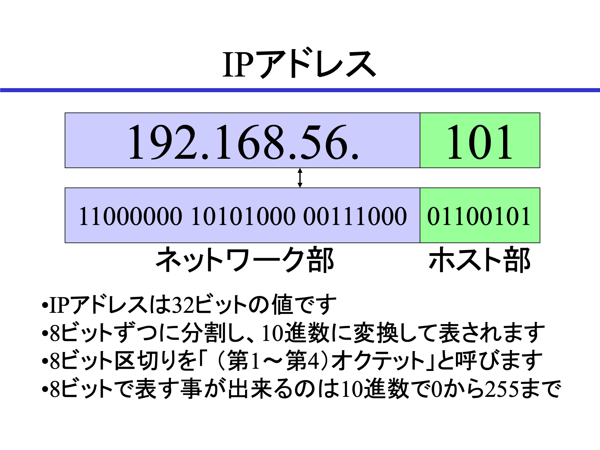{width=70%}

## ネットワークアドレスとネットマスク
ネットマスクは、IPアドレスをネットワーク部とアドレス部に分割するための値です。

IPというプロトコルは、複数のノードが集まったネットワーク同士を相互に接続して通信を行う、という考え方に基づいています。そして、同じネットワークに接続されている各ノードのIPアドレスは、同じネットワーク部の値（ネットワークアドレス）を持ちます。つまり、32ビットのうち、ネットマスクで決められた部分まではすべて同じアドレス、そして残りの部分は各ノード毎に異なるアドレス値を取ります。

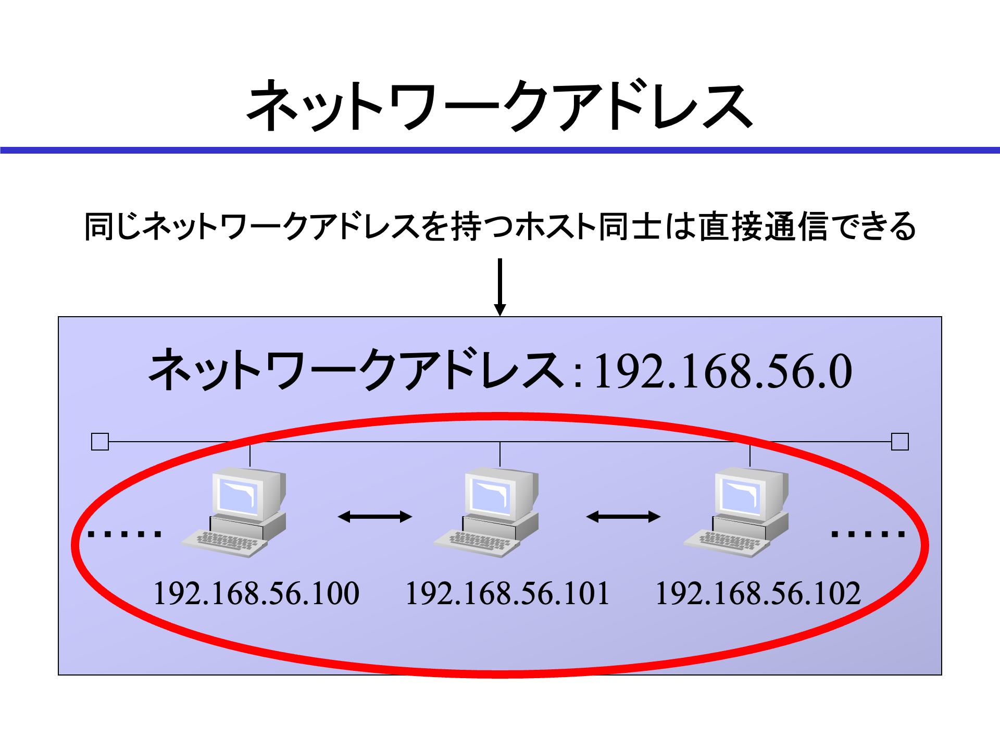{width=70%}

たとえば、「192.168.56.101」というIPアドレスのうち、第3オクテットまでの24ビットがネットワーク部だとした時、「192.168.56.101/24」とIPアドレスの後ろにネットマスクの長さを記述します。

IPアドレスは内部的には32ビットの2進数となります。ネットマスクとAND演算することで、ネットワークアドレスを取り出すことができます。

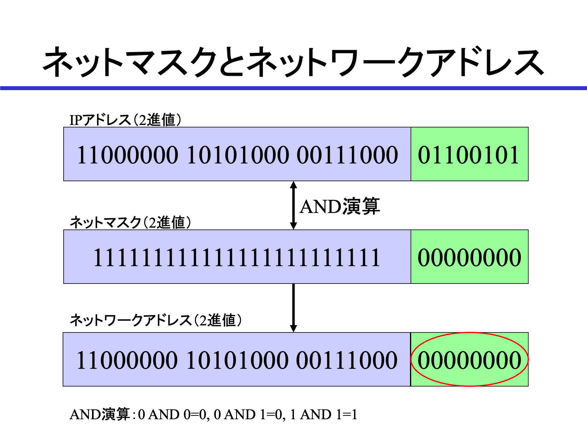{width=70%}

ネットマスクだけを表記する場合、10進数に変換して「255.255.255.0」と表記します。

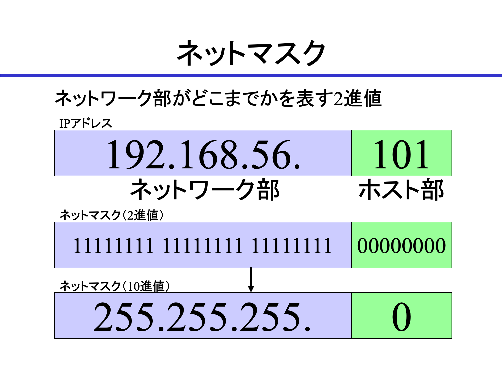{width=70%}

### ネットワークアドレスの表記
ネットワークアドレスを表記する場合、ネットマスクを利用してネットワーク部を計算し、アドレス部はすべて0として扱います。

「192.168.56.101/24」の場合、「192.168.56.0/24」がネットワークアドレスとなります。

### ネットワークアドレスの使い方
ネットマスクは、IPアドレスからネットワークアドレスを計算するために使われます。ネットワークアドレスを計算すると、自分と通信相手が同じネットワークに接続されているノード同士かどうかがわかります。

計算するためには、相手が同じネットワークに接続されているノードのIPアドレスと仮定します。その場合、相手も同じネットマスクの値であると仮定されます。このルールを利用して計算します。

たとえば、以下のIPアドレスが「192.168.56.101/24」と同じネットワークに接続されているノードのものかどうかを計算してみましょう。

#### 192.168.56.102
相手も24ビットのネットマスクであれば、第3オクテットまでがネットワークアドレスです。つまり、「192.168.56.0/24」になります。これは「192.168.56.101/24」のネットワークアドレスと同じなので、同一のネットワークに接続されていると分かります。

同一のネットワークに接続されている場合、スイッチを経由して直接通信を行います。

#### 192.168.57.1
ネットワークアドレスは「192.168.57.0/24」になります。これは「192.168.56.101/24」のネットワークアドレスと異なるので、別のネットワークに接続されたノードのIPアドレスと分かります。

異なるネットワークに接続されている場合、ルーターを経由して通信を行います。ルーターは相手のネットワークを探して通信を行ってくれます。これを「ルーティング」と呼びます。

## ルーティングとは
前述したとおり、異なるネットワークに接続されているノードとIPで通信するには、ルーターによるルーティングが必要です。

### インターネットはルーターの集合体
巨大なネットワークの集合体であるインターネットは、沢山のルーターで構成されています。そのため、最適な通信経路を決定する必要があります。ルーティング経路を決定するための様々なプロトコルが存在していますが、本教科書ではルーティングプロトコルの説明は省略します。興味がある人は別途調べてみてください。

### デフォルトゲートウェイ
最低限知っておくべきことは、異なるネットワークと通信する際にデフォルトでルーティングを依頼するデフォルトゲートウェイです。閉鎖されていて外部と通信を行えないネットワークでない限り、最低1つはルーターが必要です。このルーターのIPアドレスがデフォルトゲートウェイとなります。

Linuxでは、ゲートウェイアドレスとして設定します。

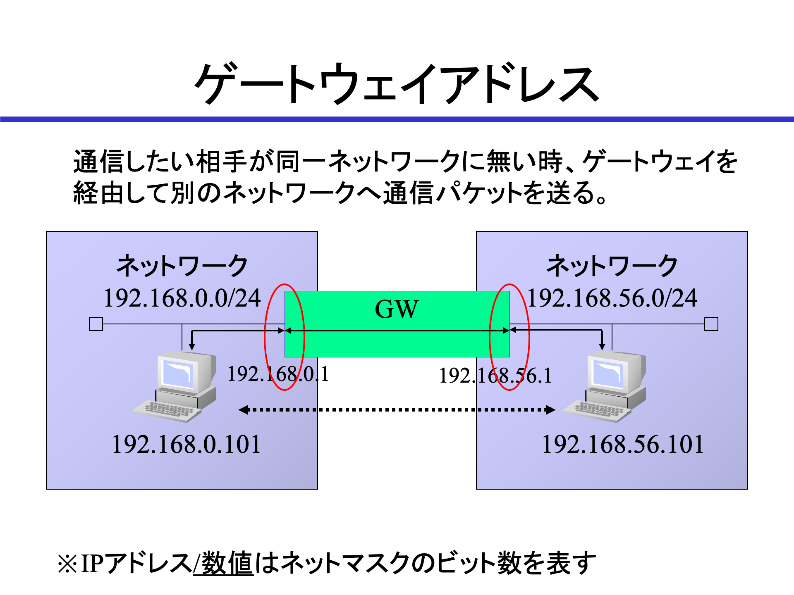{width=70%}

一般的なインターネット接続環境であれば、インターネットプロバイダーと接続しているルーターがデフォルトゲートウェイとして設定されます。社内ネットワークなど複数のネットワークで構成されている場合には、各ネットワークにルーターやL3スイッチが接続されており、これらの機器のIPアドレスがデフォルトゲートウェイとなります。

### デフォルトゲートウェイの確認
実習環境でデフォルトゲートウェイを確認してみます。確認するにはip routeコマンドを実行します（ip rと省略可能）。

```
$ ip route
default via 10.0.2.2 dev enp0s3 proto dhcp src 10.0.2.15 metric 100
10.0.2.0/24 dev enp0s3 proto kernel scope link src 10.0.2.15 metric 100
192.168.56.0/24 dev enp0s8 proto kernel scope link src 192.168.56.101 metric 101
```

実習環境は、外部との接続を行うNAT接続（10.0.2.0/24）と、ホストと接続するホストオンリーネットワーク（192.168.56.0/24）の2つのネットワークと接続しています。そして、外部との接続のために10.0.2.2というIPアドレスがデフォルトゲートウェイとして設定されていることが分かります。

## ブロードキャストアドレス
ブロードキャストアドレスは、同一のネットワークに接続されているすべてのノードに対して一斉に通信を行うためのIPアドレスです。アドレス部のビットがすべて1、オクテット区切り10進数表記であれば255になっているIPアドレスです。いくつかの通信プロトコルが、ネットワーク内に接続されているすべてのノードに対して呼びかけをするような場合に使われます。

「192.168.56.0/24」のネットワークであれば、「192.168.56.255/24」がブロードキャストアドレスになります。

ブロードキャストアドレスは自動的に計算され、必要とするソフトウェアが自動的に使用するので、設定の必要はありません。

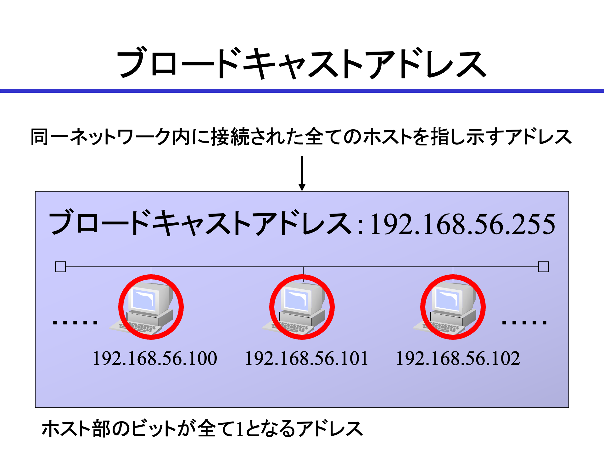{width=70%}

## アドレスクラス
約43億個あるIPアドレスを扱いやすく分類したのがアドレスクラスです。32ビット表記の先頭の値を使って5つのアドレス範囲に分割し、それぞれをクラスAからクラスEとしています。また、クラスAは8ビット、クラスBは16ビット、クラスCは24ビットのネットマスクを使用してネットワークを分割します。

| クラス | IPアドレスの範囲 | ネットマスク | ネットワーク数 | IPアドレス数 |
| - | - | - | - | - |
|クラスA | 0.0.0.0〜127.255.255.255 | 8ビット | 126個※ | 約1600万個 |
|クラスB | 128.0.0.0～191.255.255.255 | 16ビット | 16,384個 |65536個 |
|クラスC | 192.0.0.0～223.255.255.255 | 24ビット | 約209万個 | 256個 |
|クラスD | 224.0.0.0～239.255.255.255 | | |
|クラスE | 240.0.0.0～255.255.255.255 | | |

※0.0.0.0はすべてを表すIPアドレス、127で始まるネットワークはループバックで使用するため、2つのネットワークを除外しています。

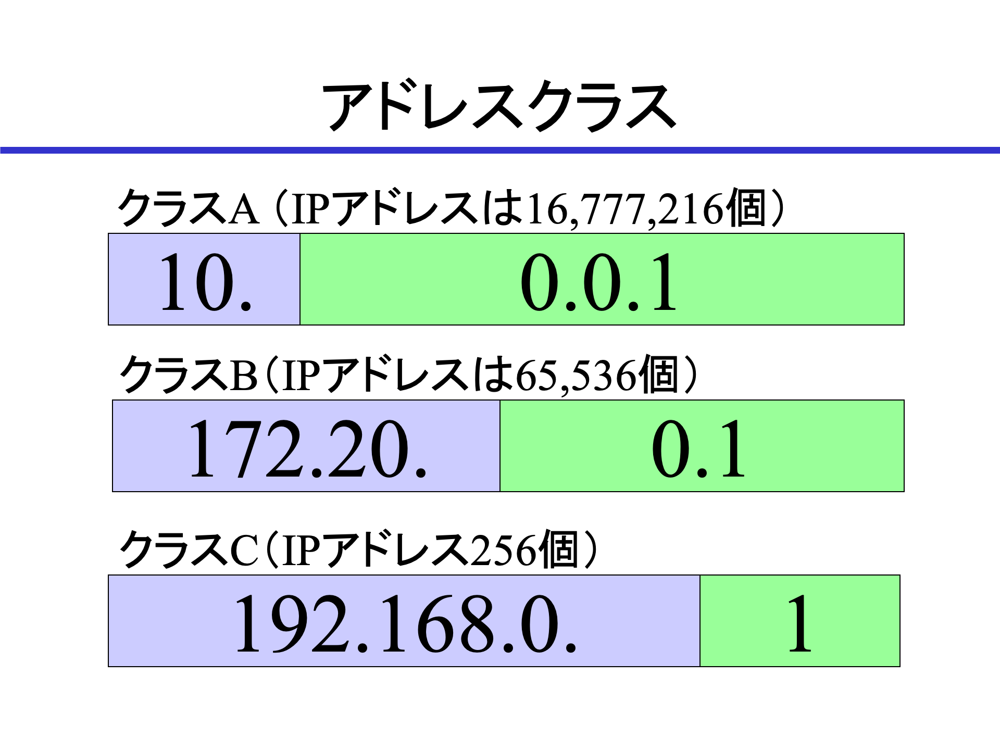{width=70%}

### CIDR
CIDR（Classless Inter-Domain Routing）は、8ビット単位のネットマスクでネットワークを分割するのではなく、任意の長さのネットマスクでネットワークを分割する方法です。

IPv4のIPアドレスの個数が限られているため、固定長のネットマスクでIPアドレスの割り当てを行うと、使用されない無駄なIPアドレスが発生してしまいます。そこで、任意の長さのネットマスクでネットワークを小さく分割するのがCIDRです。

たとえば、クラスCのアドレスの場合、ネットマスクを1ビット増やす毎に以下のようにネットワーク数とIPアドレス数が変化します。

| ネットマスク | ネットワーク数 | IPアドレス数 |
| - | - | - |
| 24 | 1個 | 256個 |
| 25 | 2個 | 128個 |
| 26 | 4個 | 64個 |
| 27 | 8個 | 32個 |
| 28 | 16個 | 16個 |
| 29 | 32個 | 8個 |

注意点として、各ネットワークにはネットワークアドレス、ブロードキャストアドレスが必要なのでIPアドレスは2個減ります。また、ルーティングのためのデフォルトゲートウェイが必要になるので、合計で3個のIPアドレスが必要となるので、ノードに割り振れるのはネットワークあたりのIPアドレス数から3個を引いた数となります。

たとえば、29ビットのネットマスクの場合、IPアドレス数は8個ですが、ノードに割り当てられるIPアドレスは5個になります。

インターネットに直接アクセスできるグローバルIPアドレスをプロバイダーから割り当ててもらう際に、28ビット（16個）や29ビット（8個）で割り当てを受ける場合があります。これらの割り当てでは、実際に使えるIPアドレスの数は減ってしまうことになります。

## グローバルIPアドレスとプライベートIPアドレス
初期のインターネットでは、すべてのノードはインターネットに直接接続されていましたが、インターネットに接続する組織が増えたため、IPアドレスが枯渇する恐れが出てきました。

そこでインターネットに直接接続できるIPアドレスをグローバルIPアドレス、逆に直接接続せず誰もが自由に利用できるIPアドレスをプライベートIPアドレスとして分けるようにしました。

プライベートIPアドレスとして定義されているのは、以下のIPアドレスです。

| クラス | IPアドレスの範囲 | ネットワーク数 |
| - | - | - |
| クラスA | 10.0.0.0〜10.255.255.255 | 1個 |
| クラスB | 172.16.0.0〜172.31.255.255 | 16個 |
| クラスC | 192.168.0.0〜192.168.255.255 | 256個|

### NAT
NAT（Network Address Translation）は、ルーティングの際にIPアドレスを変換する技術です。

プライベートIPアドレスを割り当てられたノードは、インターネット上のグローバルIPアドレスに直接アクセスできません。そこでNATを使用して、プライベートIPアドレスをグローバルIPアドレスに変換して通信を行います。一般的なインターネットに接続するためのルーターは、NATを行っています。

NATについては、後の章でLinuxカーネルが備えているアドレス変換の仕組みであるIPマスカレードで動作を確認します。

## IPアドレスの変更
LinuxにおけるIPアドレスの設定は、ディストリビューションによって様々な仕組みで行われていますが、実習環境のAlmaLinuxではNetworkManagerを使って管理を行っています。

IPアドレスの変更は、設定ファイルを直接変更するのではなく、NetworkManagerに対応したツールを使って行います。

## GUIによるIPアドレスの変更
GUIによるIPアドレスの変更は、「設定」アプリから行えます。

画面右上の「ネットワーク、音量、電源の設定」をクリックし、「設定」を選択すると「設定」アプリケーションを呼び出せます。起動時から「ネットワーク」設定が選択されています。

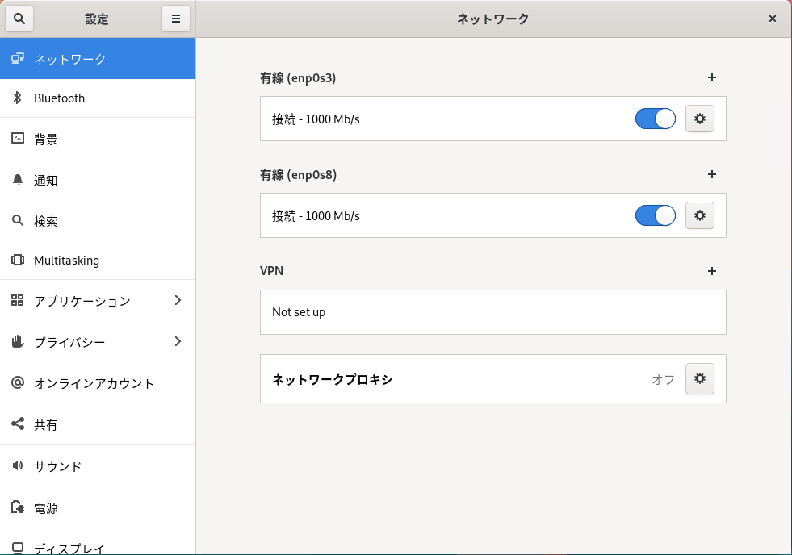{width=70%}

仮想マシンにはネットワークアダプターが2つ接続されているので、設定はそれぞれに対応した2つのインターフェースが存在しています。スイッチで有効無効が選択できます。歯車ボタンをクリックすると、設定画面が表示されます。

「詳細」では、現在の設定状態の確認や、システム起動時の自動接続などが設定できます。

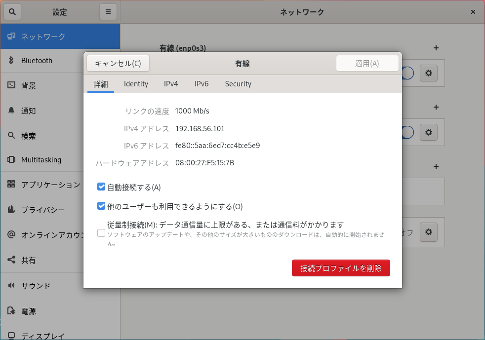{width=70%}

IPアドレスを変更するには、「IPv4」を選択します。デフォルトでは「自動（DHCP）」が選択されていますが、「手動」を選択するとIPアドレスやネットマスク（ビット数またはオクテット表記）、デフォルトゲートウェイ、参照するDNSサーバーなどを手動で設定できます。

ここではIPアドレスを「192.168.56.50/24」に変更します。

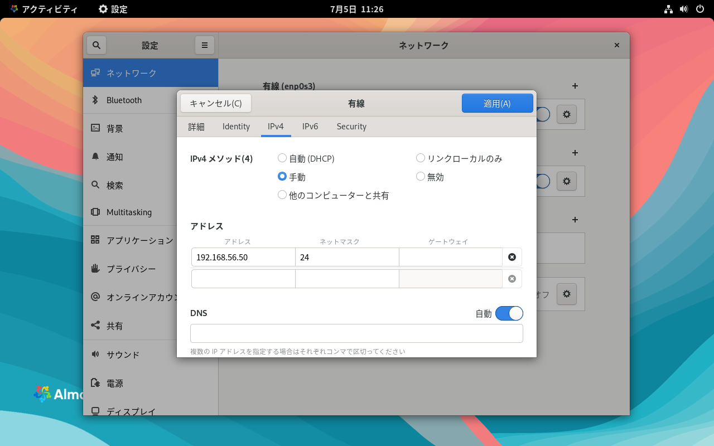{width=70%}

設定を行った後、「適用」をクリックすると設定が保存されます。

設定をネットワークインターフェースに適用するためには、歯車ボタンの左にあるスイッチをクリックして一旦ネットワークインターフェースを無効にし、再度スイッチをクリックして有効にする必要があります。

{width=70%}

## TUIによるIPアドレスの変更
GUIが使用できないSSH接続などの場合、TUI（Text User Interface）に対応したnmtuiを使用して対話形式でIPアドレスの変更が行えます。

コマンド実行可能な端末でnmtuiコマンドを実行すると、「NetworkManager TUI」が起動します。

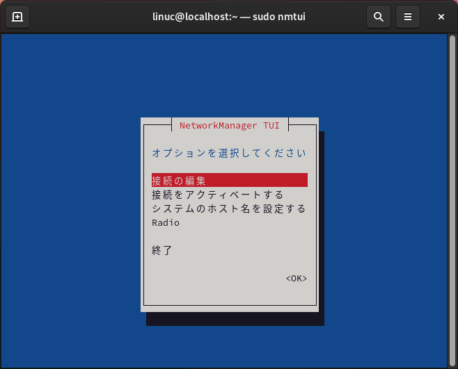{width=70%}

TUIは以下のキーで操作できます。

- TABキーで選択項目の移動
- カーソルキーで選択項目、あるいはリストなどの選択項目内での選択肢の移動
- Enterキーで選択
- ESCキーで戻る

TUI操作はかなり癖があるため、まずはTABキーで選択項目を移動さて、Enterキーを押してどのように画面が遷移するのかなどを確認してみてください。

### 操作例
たとえばIPアドレスを変更したい場合、以下のように操作します。リモートからSSHで接続している場合、SSH接続で使用しているインターフェースのIPアドレスを変更しようとすると、作業の途中で接続できなくなり、ローカルコンソールでの作業が必要になるので注意してください。

nmtuiコマンドを実行して「NetworkManager TUI」を起動します。管理者権限が必要なので、sudoコマンドを付けて実行します。

```
$ sudo nmtui
```

1. 「接続の編集」を選択して、Enterキーを押します。
1. IPアドレスを変更したいインターフェースをカーソルキーで選択し、Enterキーを押します。
1. TABキーを4回押して「IPv4 設定」の「<自動>」を選択し、Enterキーを押します。
1. カーソルキーで「手作業」を選択し、Enterキーを押します。
1. TABキーを押して「<表示する>」を選択し、Enterキーを押します。
1. TABキーを押してアドレスの「<追加...>」を選択し、Enterキーを押します。
1. 表示されたテキストボックスにIPアドレスを入力します。記述は「IPアドレス/ネットマスクのビット数」とします。
1. （必要に応じて）TABキーを3回押してゲートウェイのテキストボックスを選択し、デフォルトゲートウェイのIPアドレスを入力します。
1. （必要に応じて）TABキーを押してDNS サーバーの「<追加...>」を選択し、Enterキーを押します。
1. 表示されたテキストボックスに参照するDNSサーバーのIPアドレスを入力します。
1. TABキーを14回押して「<OK>」を選択し、Enterキーを押します。
1. インターフェース選択画面に戻るので、ESCキーを押します。
1. 最初の画面に戻るので、カーソルキーで「接続をアクティベートする」を選択し、Enterキーを押します。
1. カーソルキーで設定を有効にしたいインターフェースを選択し、Enterキーを押します。この時点でそのインターフェースは無効になります。
1. 再度Enterキーを押します。新しい設定が適用されてインターフェースが有効になります。
1. ESCキーを押します。
1. 最初の画面に戻るので、ESCキーを押してnmtuiコマンドを終了します。

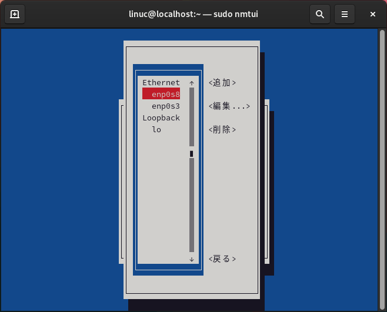{width=70%}

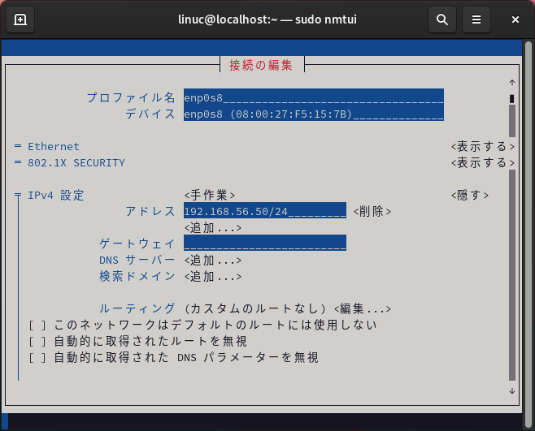{width=70%}

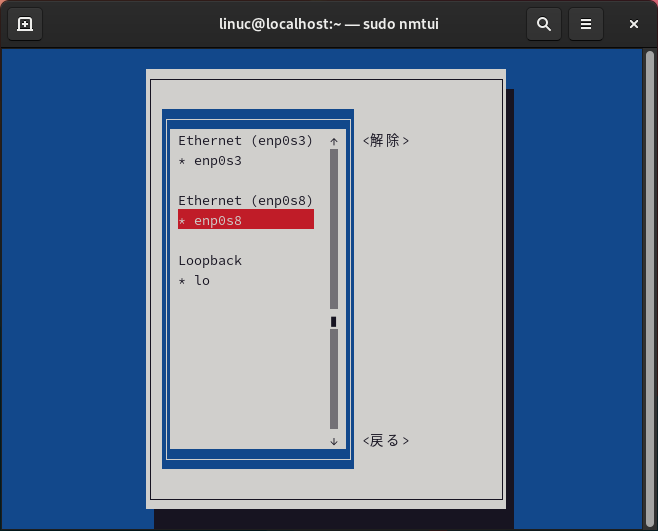{width=70%}

## コマンド実行によるIPアドレスの変更
nmcliコマンドを実行すると、コマンド実行でIPアドレスを変更できます。1回のコマンド実行、あるいはシェルスクリプト内で実行します。

### デバイスの確認
まず、nmcliコマンドを使ってNetworkManagerの設定状態を確認します。nmcli devコマンドでデバイスの状態を確認します。

```
$ nmcli dev
DEVICE  TYPE      STATE            CONNECTION
enp0s3  ethernet  接続済み         enp0s3
enp0s8  ethernet  接続済み         enp0s8
lo      loopback  接続済み (外部)  lo
```

enp0s8デバイスにはenp0s8というコネクションが適用されているのがわかります。

### デバイスの設定の確認
各デバイスがどのような設定になっているのかを確認します。nmcli dev showコマンドを使います。

```
$ nmcli dev show enp0s8
GENERAL.DEVICE:                         enp0s8
GENERAL.TYPE:                           ethernet
GENERAL.HWADDR:                         08:00:27:F5:15:7B
GENERAL.MTU:                            1500
GENERAL.STATE:                          100 (接続済み)
GENERAL.CONNECTION:                     enp0s8
GENERAL.CON-PATH:                       /org/freedesktop/NetworkManager/ActiveC>
WIRED-PROPERTIES.CARRIER:               オン
IP4.ADDRESS[1]:                         192.168.56.50/24
IP4.GATEWAY:                            --
IP4.ROUTE[1]:                           dst = 192.168.56.0/24, nh = 0.0.0.0, mt>
IP6.ADDRESS[1]:                         fe80::5aa:6ed7:cc4b:e5e9/64
IP6.GATEWAY:                            --
IP6.ROUTE[1]:                           dst = fe80::/64, nh = ::, mt = 1024
lines 1-14/14 (END)
```

設定されているIPアドレス、ルーティングの情報などが確認できます。ページングで表示されているので、qキーを入力して終了します。

### コネクションの確認
どのようなコネクションがあるのかを確認します。nmcli conコマンドを使います。

```
$ nmcli con
NAME    UUID                                  TYPE      DEVICE
enp0s3  ae880da5-eb22-3b2f-8a72-3924ffd95eaf  ethernet  enp0s3
enp0s8  f1870675-0703-4d88-8e9b-cbfcf9c22038  ethernet  enp0s8
lo      cd417d66-c5c7-4107-bc9b-d47195390c47  loopback  lo
```

コネクションはUUIDで管理されているのがわかります。

### コネクションの詳細を確認
コネクションがどのような設定なのかを確認します。nmcli con showコマンドを使います。

```
$ nmcli con show enp0s8
connection.id:                          enp0s8
connection.uuid:                        f1870675-0703-4d88-8e9b-cbfcf9c22038
connection.stable-id:                   --
connection.type:                        802-3-ethernet
connection.interface-name:              enp0s8
connection.autoconnect:                 はい
（略）
```

コネクションは非常に多くの設定項目を保持しているのがわかります。ページングで表示されているので、qキーを入力して終了します。

### IPアドレスの変更
IPアドレスをDHCPではなく指定した固定アドレスを割り当てるように変更します。コネクションの変更なのでnmcli connection modifyコマンドを使います。

リモートログインしている場合、IPアドレスが変更になると接続は切断されます。正しくIPアドレスが設定されなかった場合、リモートログインが行えなくなりますので、ローカルコンソールで作業できる状態で変更を行ってください。

まず、ipv4.methodというパラメータをmanualに変更し、ipv4.addressesにIPアドレスとネットマスクを指定します。

```
$ sudo nmcli connection modify enp0s8 ipv4.method manual ipv4.addresses 192.168.56.51/24
```

コネクションが保持している設定は修正されましたが、デバイスにはまだ修正は適用されていません。nmcli con upコマンドを実行してコネクションを有効にすることで新しい設定が適用され、IPアドレスが変更されます。

```
$ sudo nmcli con up enp0s8
```

リモートログインしている場合、この段階でIPアドレスが変更されるので接続は切断されます。再度、新しいIPアドレスに宛ててリモートログインしてみてください。

IPアドレスが変更されているかを確認します。

```
$ ip a
（略）
3: enp0s8: <BROADCAST,MULTICAST,UP,LOWER_UP> mtu 1500 qdisc fq_codel state UP group default qlen 1000
    link/ether 08:00:27:f5:15:7b brd ff:ff:ff:ff:ff:ff
    inet 192.168.56.51/24 brd 192.168.56.255 scope global noprefixroute enp0s8
       valid_lft forever preferred_lft forever
    inet6 fe80::5aa:6ed7:cc4b:e5e9/64 scope link noprefixroute
       valid_lft forever preferred_lft forever
```

IPアドレスが変更されているのが確認できます。

## DHCPとは
DHCP（Dynamic Host Configuration Protocol）は、IPアドレスなどを自動的に設定するためのプロトコルです。ネットワーク機器などにDHCPサーバー機能が組み込まれていて、DHCPクライアントがネットワークに接続するだけでIPアドレスやデフォルトゲートウェイなどが設定され、インターネットに接続できるようになります。

実習環境ではVirtualBoxにDHCPサーバーの機能が備えられているので、設定を確認してみましょう。

### VirtualBoxのDHCPサーバー機能
VirtualBoxのDHCPサーバー機能は、NATおよびホストオンリーネットワークで利用できます。NATは設定値が固定されているので、ホストオンリーネットワークのDHCPサーバー機能で設定を見てみましょう。

ホストオンリーネットワークのDHCPサーバーの設定は、1章で確認したVirtualBoxのネットワーク設定ツールで確認、変更が行えます。

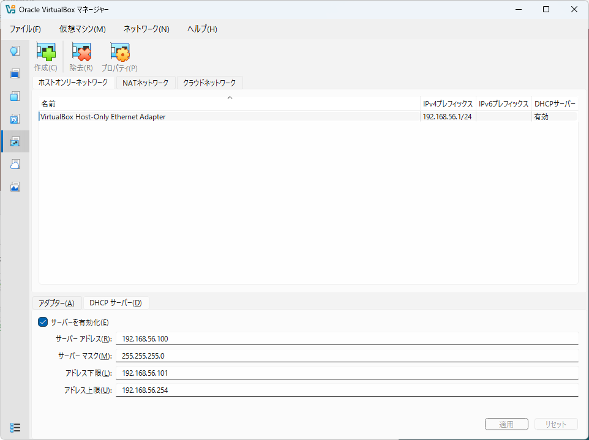{width=70%}

デフォルトの設定で、DHCPサーバーはDHCPクライアントに対して192.168.56.101から192.168.56.254までのIPアドレスを割り当てるのがわかります。

### DHCPでIPアドレスを取得する
実際にDHCPサーバーがIPアドレスを割り当てる様子を見てみましょう。

現在、ホストオンリーネットワークに接続されているネットワークアダプター2は、ゲストOSではenp0s8という名前のインターフェース、コネクションとして管理されており、前の実習でIPアドレスを手動で設定しました。この設定をDHCPで自動的にIPアドレスを設定するように変更します。GUIやTUIでは自動設定に変更して、設定を適用します。

### CLIでDHCPで自動的にIPアドレスを取得する設定を行う
CLIのnmcliコマンドを実行して、IPアドレスを手動設定からDHCPによる自動設定に変更します。

nmcli connection modifyコマンドを実行して、ipv4.methodパラメータをautoに設定し、手動設定したIPアドレスを-ipv4.addressesパラメータ（マイナス付）で削除します。

```
$ sudo nmcli connection modify enp0s8 ipv4.method auto -ipv4.addresses 192.168.56.51/24
```

nmcli con upコマンドでコネクションを有効にします。

```
$ sudo nmcli con up enp0s8
```

IPアドレスを確認して、DHCPサーバーからIPアドレスが割り当てられていることを確認します。

```
$ ip a
（略）
3: enp0s8: <BROADCAST,MULTICAST,UP,LOWER_UP> mtu 1500 qdisc fq_codel state UP group default qlen 1000
    link/ether 08:00:27:f5:15:7b brd ff:ff:ff:ff:ff:ff
    inet 192.168.56.101/24 brd 192.168.56.255 scope global dynamic noprefixroute enp0s8
       valid_lft 597sec preferred_lft 597sec
    inet6 fe80::5aa:6ed7:cc4b:e5e9/64 scope link noprefixroute
       valid_lft forever preferred_lft forever
```

DHCPサーバーの下限に設定された192.168.56.101がIPアドレスとして自動設定されていることが確認できます。

