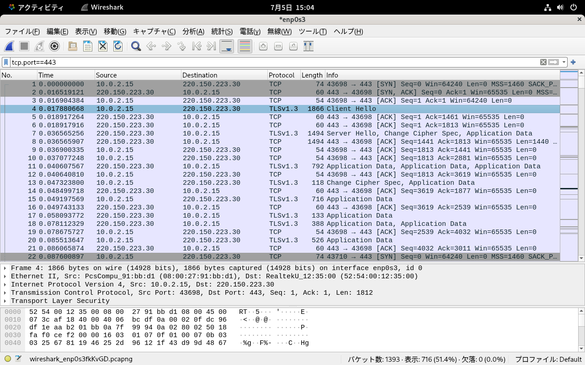
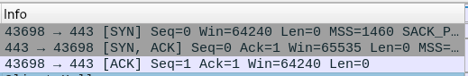
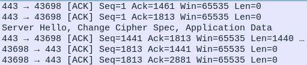
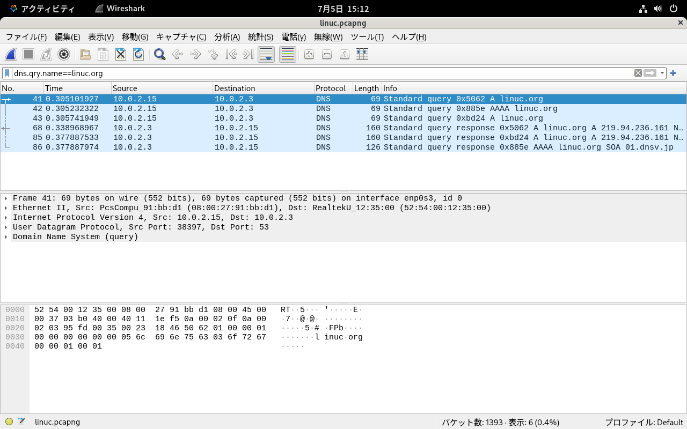
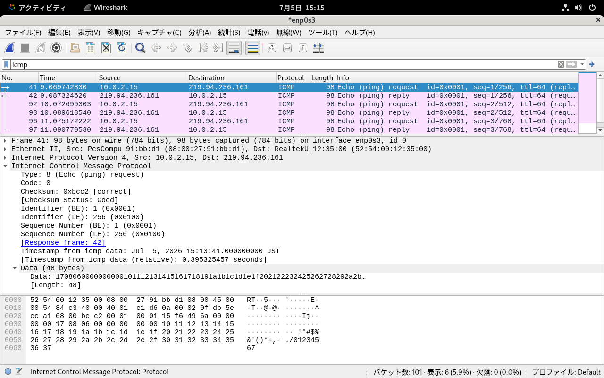

# TCP/UDP/ICMP
TCPやUDP、ICMPはIP通信の上で使用されるプロトコルです。インターネットの様々なサービスは、これらのプロトコルを使って動作しています。

プロトコルの特徴が異なるので、それぞれについて解説します。

## TCPとは
TCP（Transmission Control Protocol）は、様々な通信制御を行うプロトコルです。

IPと組み合わせてインターネットの様々な場面で使用されるため、TCP/IPと呼ばれることもあります。

### 3wayハンドシェイク
TCPは、通信を開始する際に3wayハンドシェイクと呼ばれる方法でセッションを確立します。

1. 送信側は、通信を開始するためにSYN（Synchronize・同期）フラグを設定したパケットを受信側に送信します。
2. 受信側は、送られてきたSYNフラグに対してACK（Acknowledgement・了承）フラグと、自分の側からのSYNフラグを設定したパケット、すなわちSYN＋ACKフラグのパケットを送信側に送信します。
3. 送信側は、受信側からのSYNフラグに応答するACKフラグを設定したパケットを受信側に送信します。

※図入れる

この3つのやり取りで3wayハンドシェイクは完了し、通信のためのセッションが確立します。

### シーケンス番号と通信の保証
3wayハンドシェイクのやり取りでは、お互いのシーケンス番号を交換しています。

送信側は、データを送信する際にパケットに自分のシーケンス番号を設定し、その値をパケットにつけて送信します。

受信側は、受け取ったパケットのシーケンス番号にデータサイズを足した値を確認応答番号として送信側に返信します。この確認応答番号が次に送受信すべきパケットのシーケンス番号となります。

※図入れる

もしパケットが途中の通信経路で失われてしまうと、送信したはずのパケットの確認応答番号が戻って来ない事になります。一定時間待っても確認応答番号が戻らない場合、再度パケットを送信します。

このようにして、TCPは通信パケットが失われないようにすることを保証しています。

## UDPとは
UDP（User Datagram Protocol）は、TCP同様にIPネットワークでデータ通信を行うためのプロトコルです。TCPと異なり、3wayハンドシェイクやシーケンス番号による通信の保証を行わない、軽量な通信プロトコルです。

UDPが使われている代表的な通信プロトコルとして、DNSに対する名前解決の問い合わせがあります。

### UDPはセッションレスプロトコル
TCPが通信のためのセッションを確立してから通信を行うのに対して、UDPはセッションの無いセッションレスのプロトコルです。そのため、通信パケットが通信経路の途中で失われても分からないため、再送要求は行われません。

UDPを利用するアプリケーションは、自分の送信したUDPパケットに対する返信が無い場合には、一定時間待った後にタイムアウトさせて、必要に応じて再度UDPパケットを送信するなどの処理が必要です。

## ポート番号とは
ポート番号は、TCPやUDPが使う送信側や受信側を識別するための値です。IPアドレスがネットワークに接続されたノードに紐付けられるのに対して、ポート番号は通信を行うプロセスに紐付けられます。

たとえば、HTTPSでWebサーバーに対して通信を行う場合、ポート番号443番に対して通信を行います。Webサーバー側では、Webサーバーのプロセスがポート番号443番に対する通信を待ち受け（LISTEN）、リクエストが送られてくると処理を行い、返信します。

※ポート番号の役割の図を入れる

### Well-Knownポート
ポート番号のうち、主要なプロトコルに対応付けられているポート番号0番から1023番までをWell-Knownポートと呼びます。

Linuxでは、Well-Knownポートを使用するにはroot権限が必要です。

## Registerdポート
ポート番号のうち、1024番から49151番までをRegisterdポートと呼びます。インターネットに関わる様々な事柄を管理する組織であるIANA（Internet Assigned Numbers Authority）に申請を行い、登録される（Registerd）ことで他のプロトコルとポート番号が重複しないようにしています。

### ハイポート
プロセスが自由に使えるポート番号です。IANAが管理しているWell-KnownポートとRegisterdポートよりも上の番号なのでハイ（High）ポートと呼ばれます。

ハイポートは、通信を行うクライアントが使用してサーバーからの返信を受け取るために使用したり、一部は特定のソフトウェアがIANAに未登録で使用しています。前者は、使用していたプロセスが終了すると解放されるため、エフェメラルポート（一時的なポート）と呼ばれます。

IANAの定義では49152番から65535番ですが、Linuxでは異なっています。実際にエフェメラルポートとして使われるポート番号は/proc/sys/net/ipv4/ip_local_port_rangeを参照すると確認できます。

```
$ cat /proc/sys/net/ipv4/ip_local_port_range
32768	60999
```

エフェメラルポートとして、32768番から60999番が使用されることが分かります。

### /etc/servicesを参照する
ポート番号は、/etc/servicesに名称との対応が記述されているので確認してみましょう。

```
$ tail /etc/services
aigairserver    21221/tcp               # Services for Air Server
ka-kdp          31016/udp               # Kollective Agent Kollective Delivery
ka-sddp         31016/tcp               # Kollective Agent Secure Distributed Delivery
edi_service     34567/udp               # dhanalakshmi.org EDI Service
axio-disc       35100/tcp               # Axiomatic discovery protocol
axio-disc       35100/udp               # Axiomatic discovery protocol
pmwebapi        44323/tcp               # Performance Co-Pilot client HTTP API
cloudcheck-ping 45514/udp               # ASSIA CloudCheck WiFi Management keepalive
cloudcheck      45514/tcp               # ASSIA CloudCheck WiFi Management System
spremotetablet  46998/tcp               # Capture handwritten signatures
```

Linuxのハイポートは32768番からなので、34567番のedi_service以降は重複しています。もちろん、先にプロセスが起動してそのポート番号を使用し始めた場合、同じポート番号は使用されません。

## ICMP
ICMP（Internet Control Message Protocol）は、ネットワークの通信を制御するためのプロトコルです。

ICMPを使った通信の代表例として、pingコマンドでIP通信が正常に行えるかを確認する方法があります。pingコマンドは、内部的にICMPのEchoと、応答にEcho Replyを使っています。

### ICMPはTCP/UDPとは別のプロトコル
ICMPは、TCPやUDP同様にIP上で使用されるプロトコルですが、TCPやUDPとは異なるプロトコルです。

たとえば、pingコマンドには応答するが、Webブラウザでのアクセスが通らないといった場合、パケットフィルタリングなどでTCPのパケットをフィルタされている可能性があります。逆に、ICMPを通さない設定にしているルーターやファイアーウォールなどもあります。

pingコマンドに応答が無い場合でもIP通信は正常にできていることもあるので、pingコマンドの実行結果はあくまで1つの手掛かりであって、その他の通信の結果もふまえて通信の状態を判断する必要があります。

## TCPの通信をWiresharkで見てみよう
Wiresharkを使って、TCP通信の特徴である3wayハンドシェイクのパケットのやり取りを見てみましょう。

### パケットキャプチャを開始する
Wiresharkの起動方法は1章で解説しました。起動後、NAT接続でインターネットと通信ができるenp0s3を選択します。

画面左上の「パケットキャプチャを開始します」ボタンをクリックします。

### Webサイトにアクセスする
Webブラウザを起動し、インターネット上のWebサーバーにアクセスします。

実行例では「https://linuc.org/」にアクセスしています。

### パケットキャプチャを停止する
Webサイトにアクセスが完了したら、パケットキャプチャを停止します。

### 条件でフィルタリングを行う
TCPのやり取りを確認するために、条件を指定してフィルタリングを行います。

今回はHTTPS通信をやり取りするパケットを絞り込みたいので、宛先ポートあるいは発信ポートのいずれかがTCPの443番となっているパケットを指定します。いずれか（or）条件を指定するには2つの条件を「||」でつなげて指定します。

```
tcp.dstport==443 || tcp.srcport==443
```

あるいは、送受信双方のポート番号が443番であることを指定しても同じ結果が得られます。

```
tcp.port==443
```

{width=70%}

### 3wayハンドシェイクを確認する
表示されたパケットの最初の3つが通信を開始する3wayハンドシェイクのパケットです。

1. SYNフラグが設定されたパケットが送信される
2. SYNフラグおよびACKフラグが設定されたパケットを受信する
3. ACKフラグが設定されたパケットが送信される

{width=70%}


### その後のやり取りを観察する
3wayハンドシェイクは、通信を行うノード間でシーケンス番号を交換するのを目的としています。

3wayハンドシェイク後の通信を観察すると、シーケンス番号（Seq）と確認応答番号（Ack）が送信され、それに対して応答番号をシーケンス番号に置き換えたパケットが返信される通信が繰り返されていることが分かります。

例では、4番のパケットはシーケンス番号1番、データサイズは1812バイトのパケットです。これに対して、6番のパケットは確認応答番号1813番（シーケンス番号＋データサイズの値）を返しています。

このようにして、パケットが到達していることを知らせることで、TCP通信のパケットが失われないようにすることを保証しています。

{width=70%}

## UDPの通信をWiresharkで見てみよう
Wiresharkを使って、UDP通信の特徴であるセッションレスな通信を見てみましょう。

先ほどのWebサイトへのアクセスの際に行われた名前解決のパケットを表示します。

### 条件でフィルタリングを行う
DNSによる名前解決は、暗号化されていないので問い合わせ内容を直接条件として設定できます。linuc.orgの名前解決に関するパケットを絞り込みます。

```
dns.qry.name==linuc.org
```

{width=70%}

### UDPのやり取りを確認する
TCPの場合と異なり、UDPではすぐに名前解決のパケットを送信しています。それに対して、DNSサーバーも名前解決の結果をすぐに返してきています。

UDPはセッションを確立せずにやり取りを行うセッションレスな通信プロトコルであることが分かります。

## ICMPの通信をWiresharkで見てみよう
Wiresharkを使って、ICMP通信の代表例であるpingコマンドの通信を見てみましょう。

### パケットキャプチャを開始する
Webサイトへのアクセスの例と同様に、Wiresharkでパケットキャプチャを開始します。

キャプチャしたパケットを保存するかを確認するダイアログが表示されますが、「保存せずに続ける」ボタンをクリックします。

### pingコマンドを実行する
ターミナルでpingコマンドを実行して、ICMPによる通信を行います。

```
$ ping linuc.org
```

応答が得られたら、Ctrl+Cキーを押して停止します。

### パケットキャプチャを停止する
パケットキャプチャを停止します。

### 条件でフィルタリングを行う
ICMPのやり取りを確認するために、条件を指定してフィルタリングを行います。単純にICMPのパケットだけを絞り込みます。

```
icmp
```

### ICMPのやり取りを観察する
パケットは、自分から送られたEcho requestと、それに対するEcho replyがpingコマンドが行った回数分だけ表示されます。

Wiresharkのウインドウ真ん中のペインで、「Internet Control Message Protocol」をクリックすると、ICMPパケットの中身を見ることができます。

{width=70%}

Echo requestは、ICMPのTypeが8、Echo replyはTypeが0になっており、非常にシンプルな通信を行っていることが分かります。


