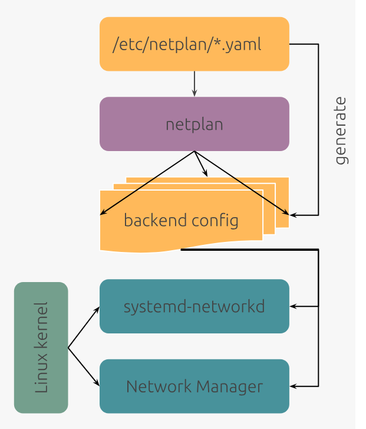
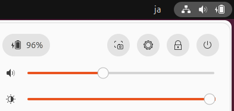
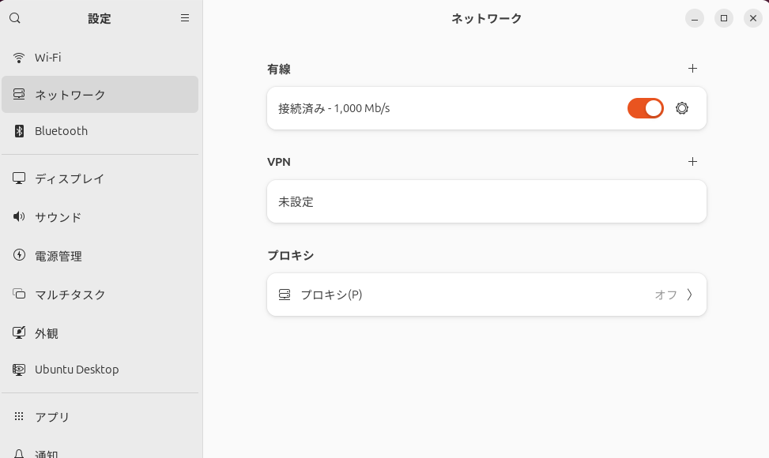
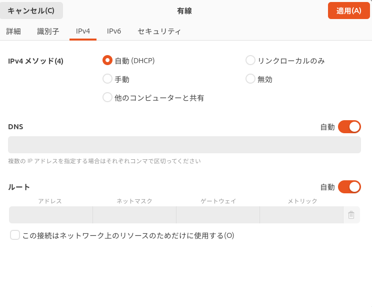
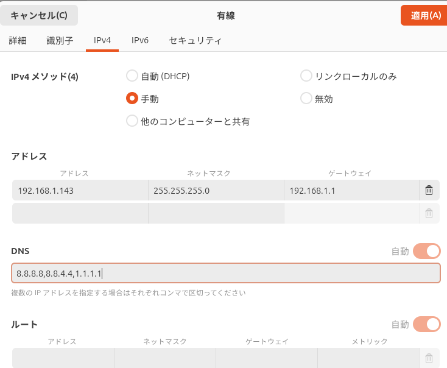
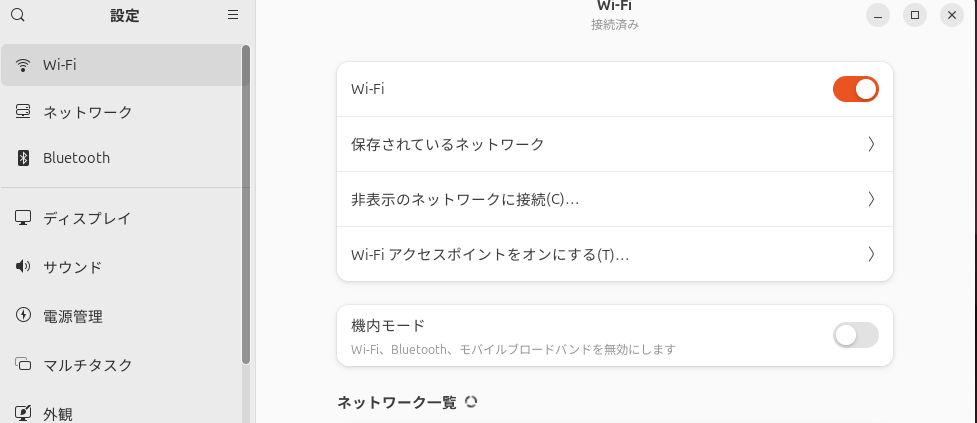
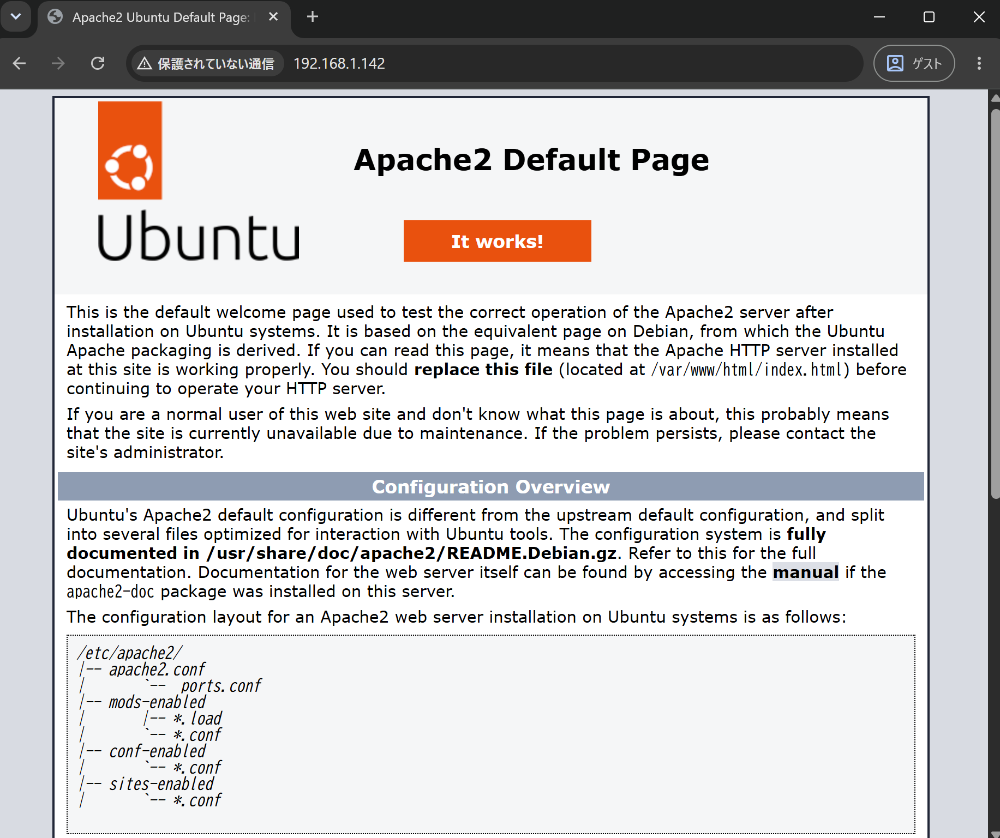
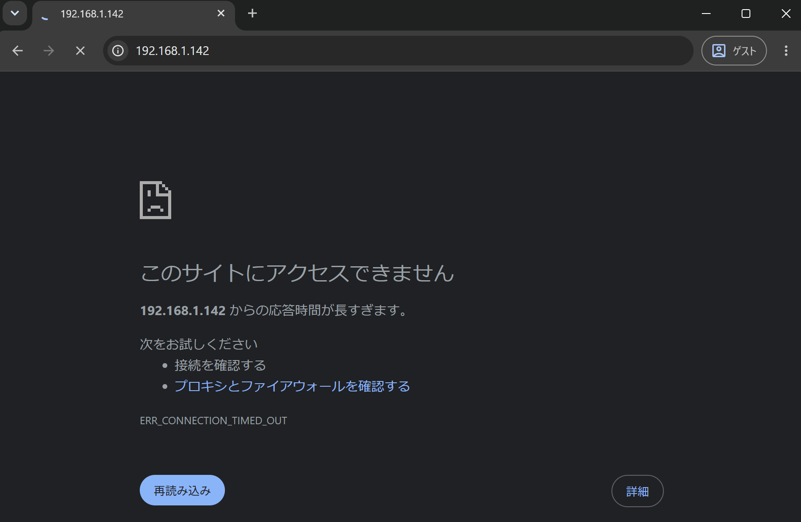

# はじめに
この章では、Ubuntuのネットワーク管理について解説します。
なお、操作はUbuntu26.04LTS/24.04LTSを使っています。

## Ubuntuのネットワーク管理
Ubuntuのネットワーク管理ではnetplanが設定の管理を行い、OSのバックエンド(レンダラー)がネットワークインターフェイスにIPアドレスなどを付与します。

/etc/netplan/配下の*.yamlファイルに設定を記載し、生成されたコンフィグをレンダラーが使用します。
レンダラーは、Ubuntu DesktopではNetworkManager、Ubuntu Serverではsystemd-networkdが担います。

{width=70%}

## Ubuntu Desktopでのネットワーク設定
Ubuntu DesktopではGUI操作でネットワーク設定を行います。
タスクバー(画面の例だと右上)から設定アイコンをクリックし、ネットワークメニューから設定を行います。

{width=70%}

以下の例では、DHCPでネットワーク設定を行っています。

{width=70%}
{width=70%}

固定IPアドレスなどを設定する場合、手動を選択します。

{width=70%}

また、無線NW(Wi-Fi)は、Wi-Fiメニューから設定を行います。

{width=70%}

## Ubuntu Serverでのネットワーク設定
Ubuntu ServerではCLI(コマンド)操作でネットワーク設定を行います。

設定を確認すると、IPアドレスとして192.168.1.143、ゲートウェイは192.168.1.1が設定されていることが分かります。
```
ubuntu@ubuntu2604:~$ ip addr show
1: lo: <LOOPBACK,UP,LOWER_UP> mtu 65536 qdisc noqueue state UNKNOWN group default qlen 1000
    link/loopback 00:00:00:00:00:00 brd 00:00:00:00:00:00
    inet 127.0.0.1/8 scope host lo
       valid_lft forever preferred_lft forever
    inet6 ::1/128 scope host noprefixroute
       valid_lft forever preferred_lft forever
2: enp0s3: <BROADCAST,MULTICAST,UP,LOWER_UP> mtu 1500 qdisc pfifo_fast state UP group default qlen 1000
    link/ether 08:00:27:f4:77:82 brd ff:ff:ff:ff:ff:ff
    altname enx080027f47782
    inet 192.168.1.143/24 metric 100 brd 192.168.1.255 scope global dynamic enp0s3
       valid_lft 7157sec preferred_lft 7157sec
    inet6 240f:32:57b8:1:a00:27ff:fef4:7782/64 scope global dynamic mngtmpaddr noprefixroute
       valid_lft 295sec preferred_lft 295sec
    inet6 fe80::a00:27ff:fef4:7782/64 scope link proto kernel_ll
       valid_lft forever preferred_lft forever

ubuntu@ubuntu2604:~$ ip route show
default via 192.168.1.1 dev enp0s3 proto dhcp src 192.168.1.143 metric 100
```

上記は、以下のnetplan設定ファイル(yamlファイル)で行われています。
```
ubuntu@ubuntu2604:~$ sudo cat /etc/netplan/00-installer-config.yaml
# This is the network config written by 'subiquity'
network:
  ethernets:
    enp0s3:
      dhcp4: true
      dhcp6: true
      match:
        macaddress: 08:00:27:f4:77:82
      set-name: enp0s3
  version: 2
```

DHCPから固定IPに設定を変更する場合は、上記yamlファイルを変更します。
```
network:
  version: 2
  renderer: networkd
  ethernets:
    enp0s3:
      dhcp4: false
      addresses:
        - 192.168.1.142/24
      routes:
        - to: default
          via: 192.168.1.1
      nameservers:
        addresses: [8.8.8.8, 8.8.4.4, 1.1.1.1]
```

変更の適用は、netplan applyを実施します。
```
ubuntu@ubuntu2604:/etc/netplan$ sudo netplan apply

ubuntu@ubuntu2604:~$ ip addr show
1: lo: <LOOPBACK,UP,LOWER_UP> mtu 65536 qdisc noqueue state UNKNOWN group default qlen 1000
    link/loopback 00:00:00:00:00:00 brd 00:00:00:00:00:00
    inet 127.0.0.1/8 scope host lo
       valid_lft forever preferred_lft forever
    inet6 ::1/128 scope host noprefixroute
       valid_lft forever preferred_lft forever
2: enp0s3: <BROADCAST,MULTICAST,UP,LOWER_UP> mtu 1500 qdisc pfifo_fast state UP group default qlen 1000
    link/ether 08:00:27:f4:77:82 brd ff:ff:ff:ff:ff:ff
    altname enx080027f47782
    inet 192.168.1.142/24 brd 192.168.1.255 scope global enp0s3
       valid_lft forever preferred_lft forever
    inet6 240f:32:57b8:1:a00:27ff:fef4:7782/64 scope global dynamic mngtmpaddr noprefixroute
       valid_lft 299sec preferred_lft 299sec
    inet6 fe80::a00:27ff:fef4:7782/64 scope link proto kernel_ll
       valid_lft forever preferred_lft forever
```

DNS設定はresolvectl statusコマンドで、netplanのyamlファイルの結果は/run/systemd/network/10-netplan-enp0s3.networkというファイルに反映されています。
```
ubuntu@ubuntu2604:~$ resolvectl status enp0s3
Link 2 (enp0s3)
    Current Scopes: DNS
         Protocols: +DefaultRoute -LLMNR -mDNS -DNSOverTLS DNSSEC=no/unsupported
Current DNS Server: 8.8.8.8
       DNS Servers: 8.8.8.8 8.8.4.4 1.1.1.1
     Default Route: yes

ubuntu@ubuntu2604:~$ sudo cat /run/systemd/network/10-netplan-enp0s3.network
[Match]
Name=enp0s3

[Network]
LinkLocalAddressing=ipv6
Address=192.168.1.142/24
DNS=8.8.8.8
DNS=8.8.4.4
DNS=1.1.1.1

[Route]
Destination=0.0.0.0/0
Gateway=192.168.1.1
```

## ボンディングについて
詳細な設定方法については割愛しますが、netplanではボンディングにも対応しています。
https://netplan.readthedocs.io/en/stable/multi-nic-vm-host-with-bonds-and-vlans/

## パケットフィルタリング
Ubuntuのパケットフィルタリングでは、ufw(Uncomplicated FireWall)を使用します。

ufwの動作を確認するため、Webサーバであるapache2をインストールします。
```
ubuntu@ubuntu2604:~$ sudo apt update

ubuntu@ubuntu2604:~$ sudo apt install apache2
```

インストール後、UbuntuのIP宛てに他PCのブラウザよりアクセスすると、
「It works!」と書かれたデフォルトページが表示されます、

{width=70%}

では、ufwの設定を行います。
初期状態ではufwは非アクティブとなっており、Ubuntuへアクセスしてくる通信は制御していません。
```
ubuntu@ubuntu2604:~$ sudo ufw status
Status: inactive
```

この状態でufwをアクティブ(有効化)すると、全ての通信をブロックしてしまうので、
サーバの管理に必要なssh(22/tcp)やhttp/https(80/tcp・443/tcp)への通信を許可します。
```
ubuntu@ubuntu2604:~$ sudo ufw allow proto tcp from 192.168.1.0/24 to any port 22
Rules updated

ubuntu@ubuntu2604:~$ sudo ufw allow proto tcp from 192.168.1.0/24 to any port 80
Rules updated

ubuntu@ubuntu2604:~$ sudo ufw allow proto tcp from 192.168.1.0/24 to any port 443
Rules updated
```

ufwをアクティブにします。
```
ubuntu@ubuntu2604:~$ sudo ufw enable
Command may disrupt existing ssh connections. Proceed with operation (y|n)? y
Firewall is active and enabled on system startup
```

ufwの制御ルールを確認します。
```
ubuntu@ubuntu2604:~$ sudo ufw status
Status: active

To                         Action      From
--                         ------      ----
22/tcp                     ALLOW       192.168.1.0/24
80/tcp                     ALLOW       192.168.1.0/24
443/tcp                    ALLOW       192.168.1.0/24
```

試しにhttp/https(80/tcp・443/tcp)の通信を拒否してみます。
```
ubuntu@ubuntu2604:~$ sudo ufw deny proto tcp from 192.168.1.0/24 to any port 443
Rule updated
ubuntu@ubuntu2604:~$ sudo ufw deny proto tcp from 192.168.1.0/24 to any port 80
Rule updated
ubuntu@ubuntu2604:~$ sudo ufw status
Status: active

To                         Action      From
--                         ------      ----
22/tcp                     ALLOW       192.168.1.0/24
80/tcp                     DENY        192.168.1.0/24
443/tcp                    DENY        192.168.1.0/24
```

設定後、再度ブラウザからアクセスすると、通信が拒否され表示できないメッセージが返されます。

{width=70%}
